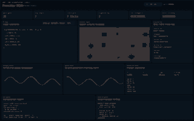

# ⚡ Frontier EDA: WebGPU/NPU Accelerated Architecture Research

[](https://3scud3r0.github.io/Frontier-EDA-WebGPU-NPU-Accelerated-Architecture-Research-Lab/)
[](https://opensource.org/licenses/MIT)
[](https://gpuweb.github.io/gpuweb/)
[](https://www.w3.org/TR/webnn/)

**Frontier EDA** é um laboratório de pesquisa em microarquitetura, compiladores e design VLSI executado inteiramente no navegador. Ao invés de simulações lógicas sequenciais em CPU, o Frontier compila *Netlists* para **Compute Shaders (WGSL)**, alavancando aceleração **WebGPU** massivamente paralela para avaliar milhões de portas NAND por segundo.

Além disso, integra **WebNN/ONNX** para pesquisa de arquiteturas assistidas por IA, implementando *Neural Branch Prediction* e heurísticas de otimização de circuitos na borda (NPU).

🌐 **[Try the Live Demo on GitHub Pages](https://3scud3r0.github.io/Frontier-EDA-WebGPU-NPU-Accelerated-Architecture-Research-Lab/)**



## 🔬 Key Research Features

* **Massive Parallel Logic (WebGPU):** A avaliação do datapath lógico ignora o event-loop do Javascript. A topologia do circuito é convertida em arrays tipados matriciais e processada em paralelo pela placa de vídeo.
* **AI-Assisted Microarchitecture (WebNN):** Modelos de *Machine Learning* leves (Perceptrons/LSTMs) rodam na NPU local para prever o *Program Counter* (Branch Prediction) baseados no histórico de trace.
* **True Physical Timing:** Modelagem transiente com suporte a *Propagation Delay* e detecção de *Hazards/Glitches*.
* **Industry-Standard Export:** Sintetizou uma nova ALU customizada? Exporte a Netlist NAND diretamente para código **Synthesizable Verilog (`.v`)** e faça flash em FPGAs físicas (Xilinx, Altera/Intel).
* **Flat Data-Dense UI:** Dashboard estilo Grafana focado na engenharia de hardware: Heatmaps de silício, escopos de timing multicanal e métricas de cache.

## 🗂️ Estrutura de Diretórios e Arquivos

```text
frontier-eda/
├── .github/
│   └── workflows/
│       └── deploy-pages.yml
├── public/
│   ├── coi-serviceworker.js
│   └── models/
│       ├── README.md
│       └── manifest.json
├── src/
│   ├── compute/
│   │   ├── gpu_fabric.js
│   │   └── logic_eval.wgsl
│   ├── intelligence/
│   │   └── npu_core.js
│   ├── core/
│   │   ├── cpu_state.js
│   │   ├── cpu_worker.js
│   │   ├── linker.js
│   │   └── assembler.js
│   ├── hdl/
│   │   └── netlist_graph.js
│   ├── export/
│   │   └── verilog.js
│   ├── storage/
│   │   └── persistence.js
│   ├── ui/
│   │   ├── dashboard.js
│   │   └── charts.js
│   ├── index.html
│   ├── styles.css
│   ├── app.js
│   └── main.js
├── tests/
│   └── research.test.mjs
├── docs/
│   ├── dashboard-preview.png
│   └── RESEARCH_NOTES.md
├── .gitignore
├── LICENSE
├── package.json
├── server.mjs
├── vite.config.js
└── README.md
```

## 🚀 Quick Start (Local Development)

Devido ao uso intenso de `SharedArrayBuffer` para troca de contexto CPU ↔ GPU em tempo real, o ambiente de desenvolvimento requer *Cross-Origin Isolation*. O Vite já está configurado para isso.

```bash
git clone https://github.com/3scud3r0/Frontier-EDA-WebGPU-NPU-Accelerated-Architecture-Research-Lab.git
cd Frontier-EDA-WebGPU-NPU-Accelerated-Architecture-Research-Lab
npm install
npm run dev
```

Abra http://localhost:5173 no navegador com suporte a WebGPU.

## 🧠 Architecture Overview

1. **TinyHDL Compiler (JS):** parsing e grafo dirigido NAND.
2. **Buffer Manager (SharedArrayBuffer):** RAM 64K, registradores, cache L1 e trace.
3. **WebGPU Core (WGSL):** StorageBuffers ping-pong, atraso de propagação e atividade.
4. **NPU Optimizer:** WebNN/ONNX quando disponível, com perceptron online funcional como fallback.

## 💾 Exporting to FPGA

```verilog
module Frontier_CustomXOR(input wire a, input wire b, output wire out);
    wire n0, n1, n2;
    assign n0 = ~(a & b);
    assign n1 = ~(a & n0);
    assign n2 = ~(b & n0);
    assign out = ~(n1 & n2);
endmodule
```

## 📜 License

Distribuído sob a licença MIT. Veja LICENSE para mais informações.
